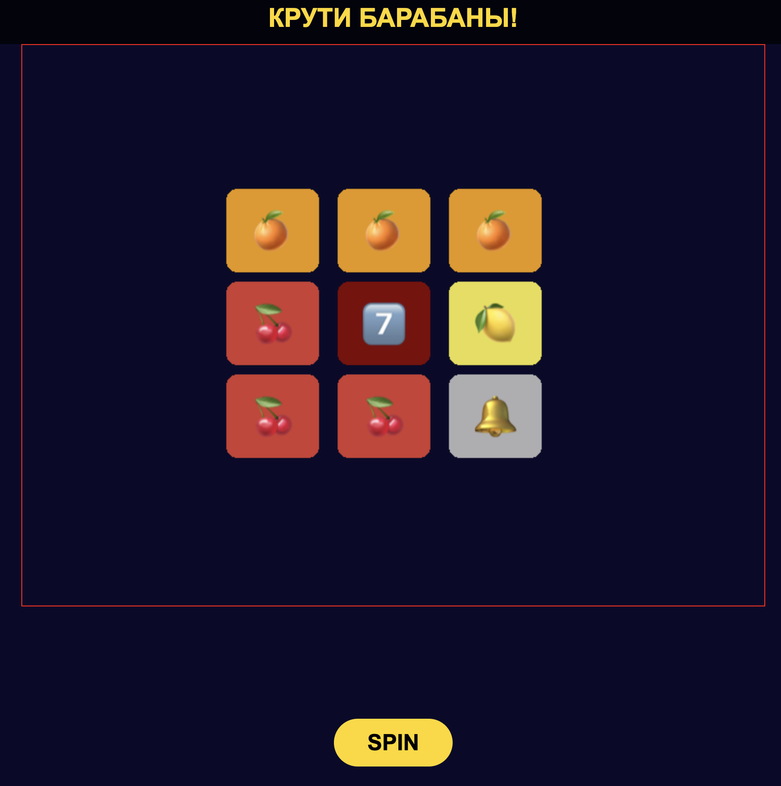

# 🎰 Slot Machine на PixiJS + Node.js

Проект представляет собой полноценный прототип игрового слота с клиент-серверной архитектурой, реализующий ключевые механики современных онлайн-автоматов: генерация виртуальных лент по весам, плавное вращение и остановка на заданном сервером результате, управление состоянием.

# 📦 Технологии
- Клиент: PixiJS 7 (рендеринг, анимация, маски), JavaScript (ES6+), Vite (сборка, прокси).
- Сервер: Node.js, Express.
- Коммуникация: Fetch API (эндпоинты /api/config, /api/spin).

# 🕹️ Игровой процесс
1. Игрок нажимает кнопку SPIN.
2. Кнопка скрывается, начинается анимация вращения барабанов.
3. Клиент отправляет запрос на сервер /api/spin.
4. Сервер генерирует случайный результат на основе весов символов и возвращает массив символов (например, ['cherry', 'lemon', 'seven']) и сумму выигрыша.
5. Клиент, получив результат, вызывает для каждого барабана метод stopAtSymbol(символ). Барабаны плавно замедляются и останавливаются так, чтобы заданный символ оказался ровно в центре видимого окна.
6. После остановки всех барабанов кнопка SPIN снова появляется, игрок может делать новую ставку.

# ⚙️ Ключевые механики 

### **1. Веса символов и генерация визуальных лент**
- Сервер хранит таблицу весов (например, { cherry:4, lemon:3, orange:2, bell:1, seven:1 }).
- Клиент при старте загружает веса через /api/config и генерирует для каждого барабана уникальную визуальную ленту (массив символов) длиной, например, сумма весов * 3. Распределение символов в ленте соответствует весам, порядок – случайный (перемешивание).
- Лента используется только для анимации; итоговый результат всегда определяется сервером.

### **2. Циклическое вращение без пропадания символов**
- Каждый барабан — это контейнер с лентой из спрайтов, расположенных вертикально с шагом SYMBOL_SIZE.
- Анимация вращения реализована через сдвиг position (в пикселях) и пересчёт y каждого спрайта по формуле y = (i * SYMBOL_SIZE - position) % maxPos с приведением к положительному диапазону. Это даёт бесконечное зацикленное вращение без видимых стыков.
- Маска ограничивает видимую область тремя символами (или другим нечётным количеством).

### **3. Плавная остановка на заданном символе**

- При вызове stopAtSymbol(symbolName) вычисляется целевое смещение targetPosition:
Находятся все индексы символа в ленте.
Выбирается ближайший индекс впереди (по направлению вращения) с учётом текущей позиции.
Вычисляется дельта в пикселях; если цель позади, добавляется полный оборот.
- В методе update(delta) при наличии targetPosition каждый кадр:
Скорость умножается на 0.96 (замедление).
Шаг = speed * delta, ограниченный оставшимся расстоянием.
Когда разница targetPosition - position становится меньше порога (0.5 пикселя), барабан фиксируется на цели и останавливается.
- Такой подход имитирует реальное торможение и не позволяет барабану перескочить мимо нужного символа.

# 🖼️ Интерфейс

# 🌐 API бэкенда
| Эндпоинт | Метод | Ответ |
| ----------- | ----------- |----------- |
| `/api/config`    | GET   | `{ symbolWeights: { cherry:4, lemon:3, orange:2, bell:1, seven:1 } }` |
| `/api/spin`    | POST   | `{ reels: ['cherry','lemon','seven'], win: 0 }` |

---
Проект создан в образовательных целях для демонстрации навыков разработки игр в iGaming индустрии.