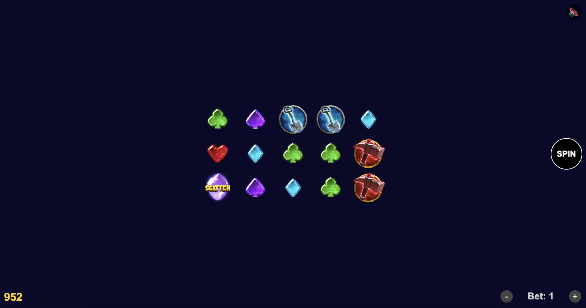
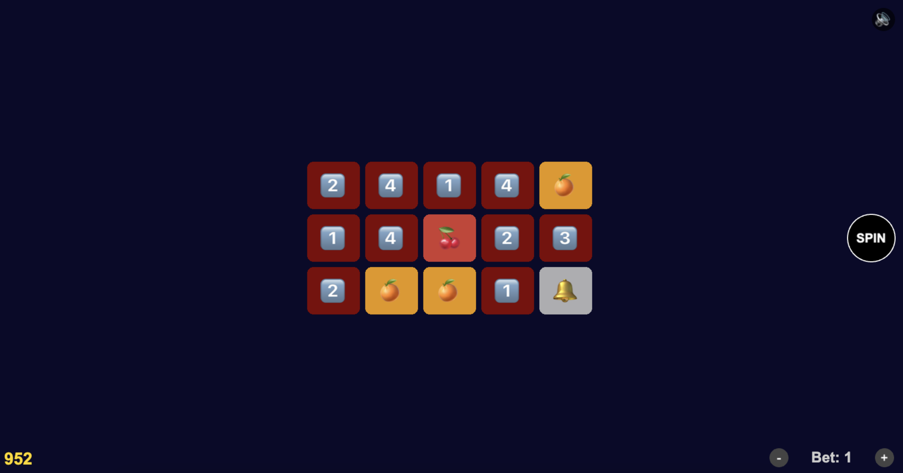

# 🎰 Слот-машина на PixiJS + XState

Учебный проект, демонстрирующий применение XState для управления игровой логикой, PixiJS для рендеринга и архитектурный подход с UI-контроллером.

# 🚀 Установка и запуск
```
# Клонирование репозитория
git clone <repo-url>
cd slot-machine

# Установка зависимостей (клиент и сервер)
cd client && pnpm install
cd ../server && pnpm install

# Запуск сервера (порт 7777)
cd server && pnpm start

# Запуск клиента (порт 3000)
cd client && pnpm dev
```

# 🧠 Архитектура

Проект построен вокруг **трёх основных слоёв**:

1. Логика игры (XState Machine)
-  **Машина** *(slotMachine/machine.js)* управляет всеми состояниями: loading, idle, spinning, stoppingReels, winAnimation, scatterActivation, freeSpins (с вложенными состояниями). 
- **Контекст** хранит баланс, ставку, результат спина, счётчики фриспинов и т.д. 
- **Действия и guards** вынесены в отдельные файлы (actions.js, guards.js). 
- **Акторы** *(actors.js)* отвечают за загрузку конфига и запрос спина к серверу.

2. Представление (PixiJS UI) 
- **Компоненты** — «тупые» объекты, не знающие об акторе. Имеют только методы show, hide, update и т.д. 
- Все компоненты создаются и управляются из **UI-контроллера** *(uiController.js)*, который подписывается на XState и обновляет UI.

3. Бэкенд (Express) 
- Отдаёт конфиг (`/api/config`), генерирует результат спина (`/api/spin`), поддерживает реплей (`/api/replay-spin`).
- Хранит состояние баланса и фриспинов в памяти (для демонстрации).
- Ленты генерируются из весов и сохраняются в `reels.json`.

# 🛠 Технологии
- **PixiJS v8** — рендеринг
- **XState v5** — управление состоянием
- **@pixi/sound** — звук
- **pixi-reels** — профессиональная анимация барабанов (опционально)
- **Express** — бэкенд
- **Vite** — сборка клиента

# 🎮 Основные механики
- Спин — списание ставки, запрос к серверу, анимация вращения и остановка.
- Линии выплат — 7 линий (горизонтальные и зигзаги), выигрыш рассчитывается по таблице выплат.
- Фриспины — активируются при 3+ Scatter, вращаются автоматически с задержкой, накапливают выигрыш.
- Ретриггеры — во время фриспинов новые Scatter добавляют дополнительные вращения.
- Баланс и ставка — изменяются через UI, ставка блокируется во время вращения.
- Реплей — воспроизведение сохранённого спина по индексам (для отладки).

# 🖼️ Интерфейс
<div align="center">
  
  
</div>


# 🌐 API бэкенда
| Эндпоинт | Метод | Описание | Ответ |
| ----------- | ----------- |----------- |--|
| `/api/config`    | GET   |Возвращает конфигурацию игры (ленты, веса, баланс)| `{ reels: [...], symbolWeights: {...}, initialBalance: 1000 }` |
| `/api/spin`    | POST   | Генерирует и возвращает результат спина (матрица, выигрыш, линии)|`{ matrix: [...], win: 0, isWin: false, winningLines: [] }` |
| `/api/replay-spin`    | POST   | Воспроизводит спин по заданным позициям (для отладки)|`{ matrix: [...], win: 0, ... }` |


# 🧪 Реплей и утилиты

## Реплей (воспроизведение спинов)
Для отладки и тестирования используется файл `client/src/replay.js`. Он позволяет воспроизвести конкретный спин с заданными позициями барабанов.

Формат replay.js:

```
{
  "debug": true,
  "positions": [12, 4, 27, 11, 26]
}
```
- debug: true — включает режим реплея.
- positions — массив из 5 индексов (по одному для каждого барабана), на которых должны остановиться ленты.

При включённом реплее клиент вместо обычного запроса `/api/spin` отправляет POST `/api/replay-spin` с переданными позициями. Это позволяет точно воспроизвести любой сценарий (выигрыш, фриспины, Scatter) без случайности.


## Утилиты для балансировки и отладки
Утилиты для балансировки и отладки
В папке server/scripts/ находятся вспомогательные скрипты.

### Поиск позиций (findPositions.js)
Ищет комбинации позиций, удовлетворяющие заданным условиям (например, 3 одинаковых символа на центральной линии).

Запуск:

```
cd server
node scripts/findPositions.js
```
Внутри скрипта можно настроить условия:
```
const targets = [
  { row: 1, count: 4, symbol: 'h4' }, // 4 h4 на центральной линии
  { row: 2, count: 3, symbol: 'l1' }, // 3 l1 на нижней линии
];
```
Скрипт выведет найденные позиции и матрицу.

### Расчёт RTP (calculateRTP.js)
Симулирует большое количество спинов (по умолчанию 100 000) и вычисляет текущий RTP (Return to Player) игры.

Запуск:

```
cd server
node scripts/calculateRTP.js
```
Вывод содержит:

Общий RTP в процентах.

Общий выигрыш и количество раундов.

Статистику по фриспинам (количество бонусов, среднее число фриспинов, средний выигрыш).

Это помогает балансировать веса символов и таблицу выплат для достижения целевого RTP (обычно 94–96%).

---
*Проект является учебным и демонстрирует архитектуру, управление состоянием и рендеринг в игровых приложениях для iGaming.*
